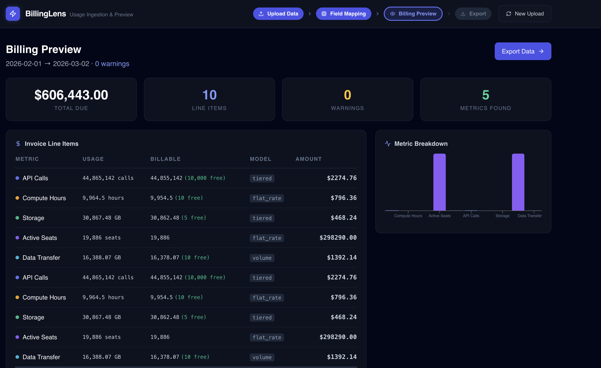
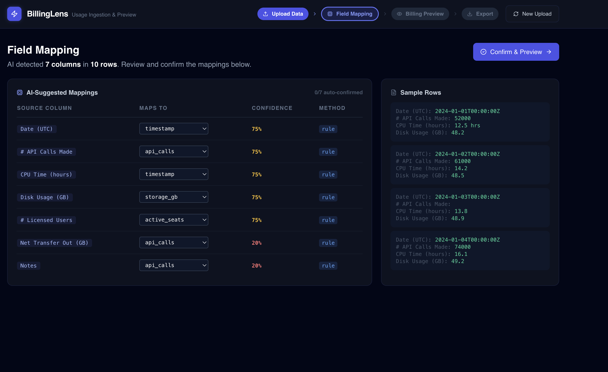

## BillingLens: Usage Data Ingestion & Billing Preview Tool

A production-ready system that ingests raw usage data from multiple sources, normalizes it with AI-assisted field mapping, and generates billing previews before invoices are sent.


---


## User Flow

```
1. UPLOAD     → Drop a CSV/JSON file (or generate mock data)
               ↓
2. MAPPING    → AI maps "# API Calls Made" → "api_calls" with 92% confidence
               → User can override any mapping
               → Click "Confirm & Preview"
               ↓
3. PREVIEW    → See itemized invoice:
               - API Calls: 2.4M calls @ tiered pricing = $182.00
               - Compute: 340 hrs @ $0.08/hr = $27.20
               - Storage: 55GB @ $0.023/GB = $1.27
               - Warnings: "Spike detected on day 14 — 15x normal"
               ↓
4. EXPORT     → Standardized JSON | Normalized CSV | Raw JSON
```

---

## AI Field Mapping

The system uses a two-tier approach:

**Tier 1 — Rule-based (fast, free):**
- Exact match: `api_calls` → `api_calls` (100% confidence)
- Alias match: `api_requests` → `api_calls` (95% confidence)
- Partial match: `# API Calls Made` → `api_calls` (75% confidence)

**Tier 2 — OpenAI GPT-4o-mini (for ambiguous fields):**
- Sends unmatched column names + sample values to GPT-4o-mini
- Returns structured JSON with target field + confidence + reasoning
- Falls back gracefully if API key not set

**Supported canonical metrics:**
| Metric | Common Aliases |
|--------|---------------|
| `api_calls` | api_requests, request_count, endpoint_calls, http_requests |
| `compute_hours` | cpu_hours, vm_hours, runtime_hours, instance_hours |
| `storage_gb` | disk_usage, storage_used, bytes_stored, disk_gb |
| `active_seats` | users, mau, user_count, licenses, active_users |
| `data_transfer_gb` | bandwidth, egress_gb, data_out, network_gb |
| `timestamp` | date, datetime, event_time, log_time |

---

## Pricing Engine

Supports all major SaaS billing models:

### Flat Rate
```
compute_hours: $0.08/hr after 10 free hours
```

### Tiered (Graduated)
```
api_calls:
  First 10,000  → FREE
  10k - 100k    → $0.0001/call
  100k - 1M     → $0.00008/call
  1M+           → $0.00005/call
```

### Volume
```
data_transfer_gb:
  ≤100 GB       → $0.09/GB (entire volume at this price)
  >100 GB       → $0.085/GB (entire volume at this price)
```

---

## Anomaly Detection

Warnings are generated for:

| Type | Trigger | Severity |
|------|---------|----------|
| `spike` | Value > 3 standard deviations from mean | Warning |
| `spike` | Total usage > 10x historical average | Critical |
| `negative_value` | Any negative quantity | Critical |
| `unknown_metric` | Metric has no pricing rule | Info |
| `zero_invoice` | All usage within free tiers | Info |

---

### Key Endpoints

| Method | Path | Description |
|--------|------|-------------|
| `GET` | `/health` | Health check + AI status |
| `GET` | `/customers` | List all customers |
| `GET` | `/pricing-plans` | List plans with pricing rules |
| `POST` | `/ingest/csv` | Upload CSV file → returns job + mappings |
| `POST` | `/ingest/json` | Upload JSON file → returns job + mappings |
| `POST` | `/ingest/webhook` | Accept webhook payload |
| `GET` | `/jobs/{id}/mappings` | Get field mappings for a job |
| `PUT` | `/jobs/{id}/mappings` | Update/confirm field mappings |
| `POST` | `/jobs/{id}/normalize` | Apply mappings, create usage records |
| `POST` | `/jobs/{id}/preview` | Generate billing preview |
| `POST` | `/jobs/{id}/export` | Export (format: justpaid, csv, json) |
| `GET` | `/mock-data/scenarios` | List available demo scenarios |
| `POST` | `/mock-data/generate` | Generate mock CSV file |

---

## Database Schema

Key tables:

- **`customers`** — Customer records
- **`pricing_plans`** + **`pricing_rules`** — Plan definitions with tiers
- **`customer_contracts`** — Customer ↔ plan assignments
- **`ingestion_jobs`** — Tracks each upload operation
- **`field_mappings`** — AI/manual column name mappings
- **`usage_records`** — Normalized usage data
- **`billing_previews`** — Generated invoice previews
- **`validation_warnings`** — Anomaly/validation results

---

## Tech Stack

| Layer | Technology |
|-------|-----------|
| Frontend | Next.js, TypeScript, Tailwind CSS, Recharts |
| Backend | FastAPI, Python 3.12, asyncpg, SQLAlchemy 2.0 |
| Database | PostgreSQL 16 |
| AI | OpenAI GPT-4o-mini (optional) |
| Infrastructure | Docker, Docker Compose |